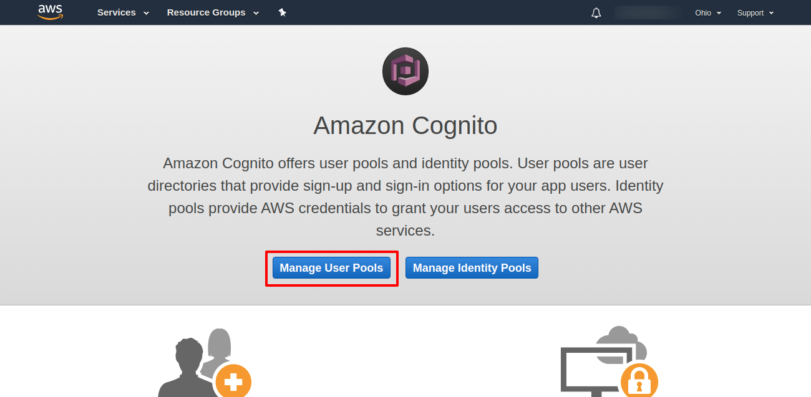
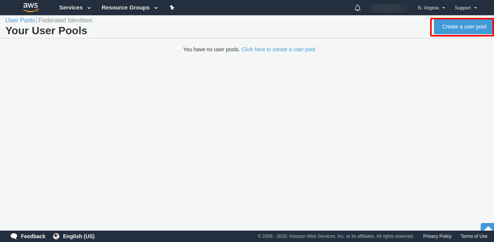
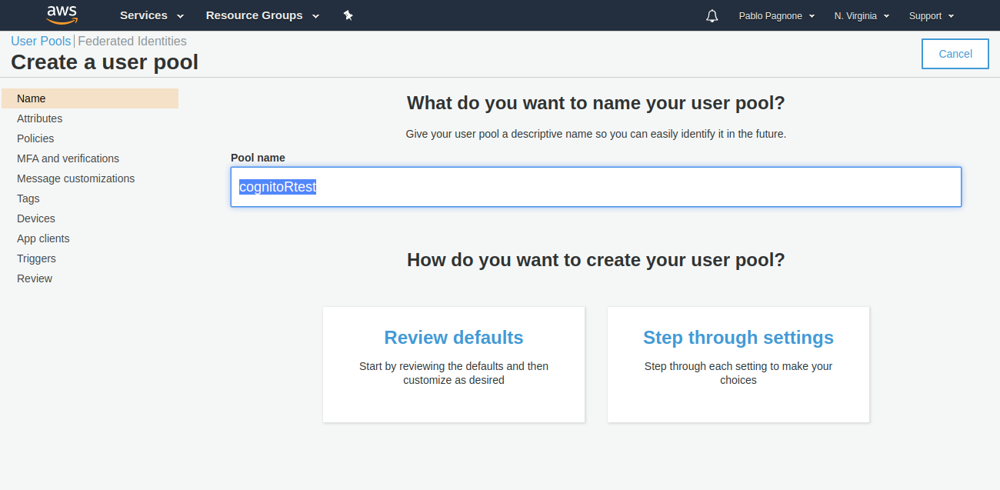
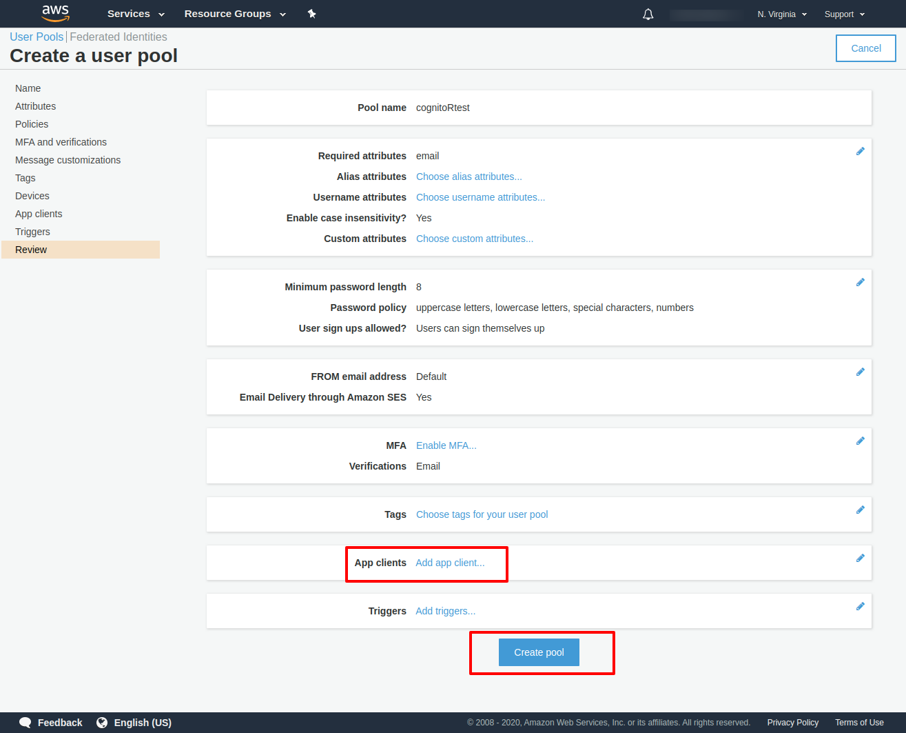
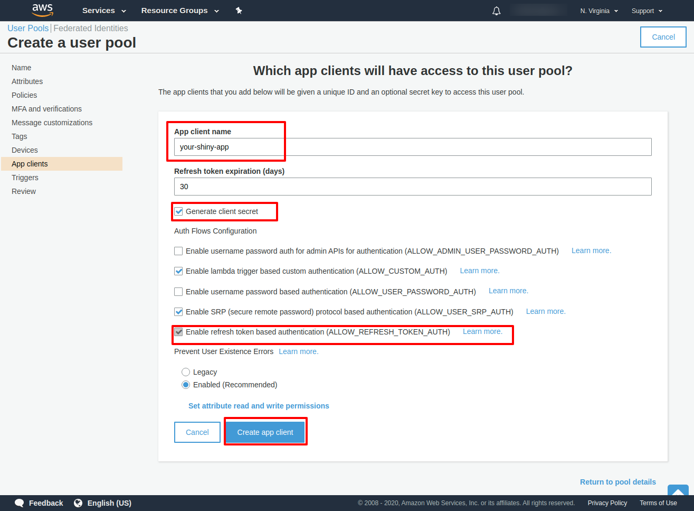
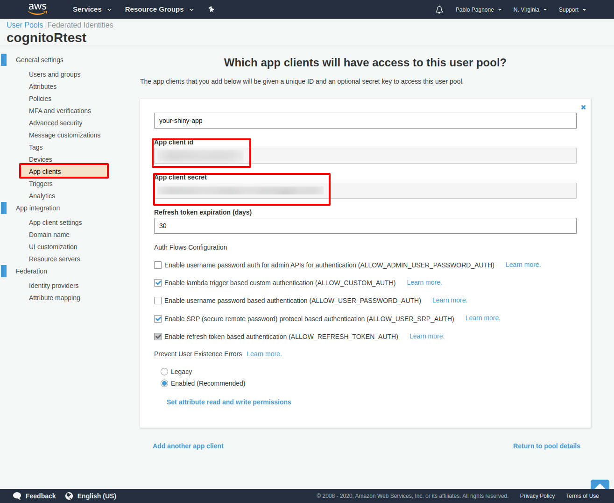
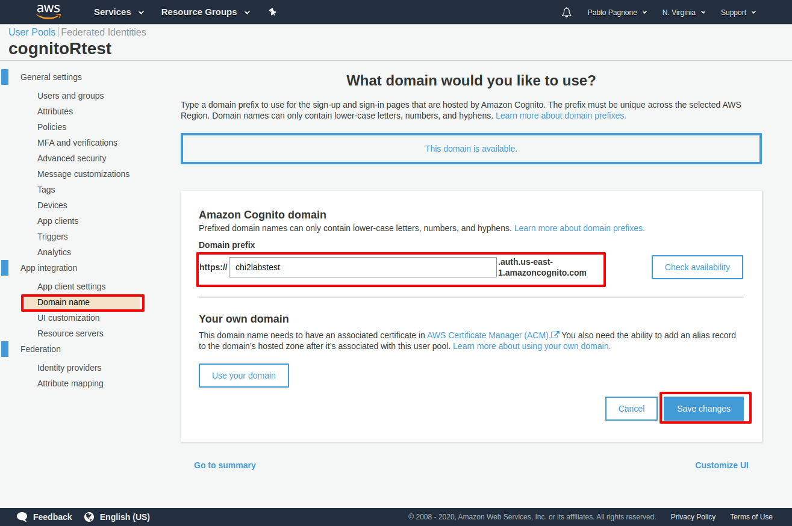
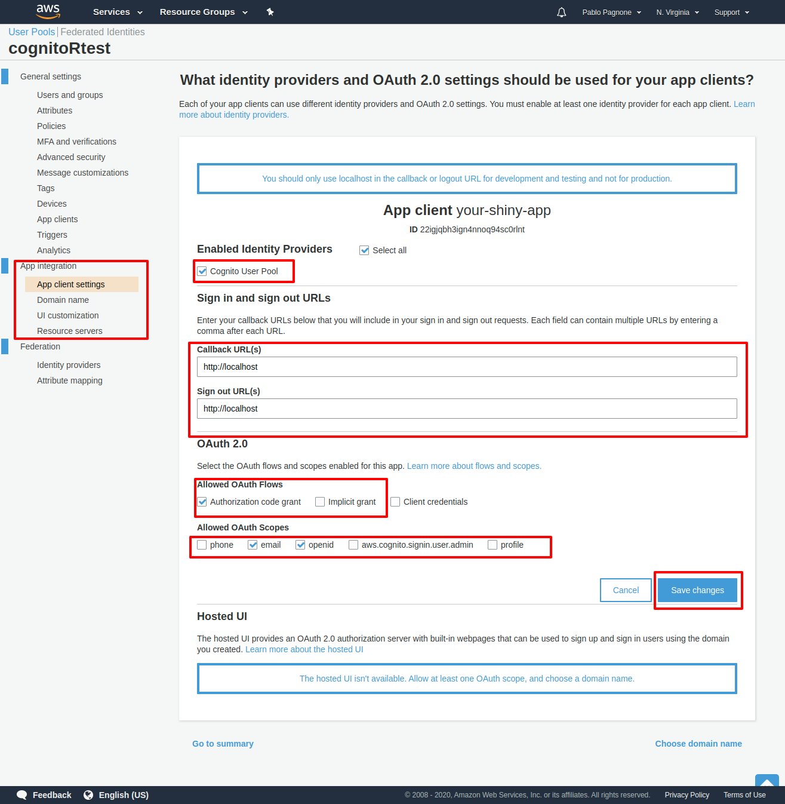
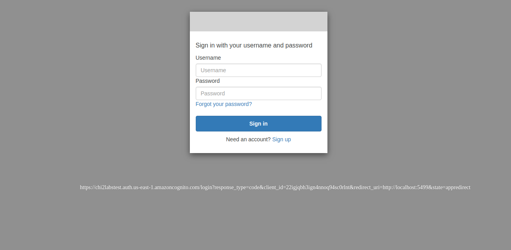

CognitoR
================

<!-- README.md is generated from README.Rmd. Please edit that file -->

<!-- badges: start -->

[](https://cran.r-project.org/package=cognitoR)
<!-- badges: end -->

## Disclaimer

This package is not provided nor endorsed by Amazon. Use it at your own
risk.

## Installation

You can install from CRAN with:

``` r
install.packages("cognitoR")
```

Or from github with:

``` r
devtools::install_github("chi2labs/cognitoR")
```

## Inspiration

This package was developed inspired on the contribution done by
<a href="https://adisarid.github.io/" target="_blank">Adi Sarid</a> in
<https://adisarid.github.io/post/2019-08-10-cognito-shiny-authentication/>
.

## Requirements

You need to have:

  - Amazon AWS account.

## About Amazon Cognito

If you do not have experience with Amazon Cognito, It is recommended to
read the official documentation: [Amazon
Cognito](https://docs.aws.amazon.com/cognito/latest/developerguide/what-is-amazon-cognito.html)

## Steps

### 1 - Going to Amazon Cognito

Once you have logged with your Amazon AWS account, go to “Cognito”
service and click on “Manage User Pools”.



### 2 - Creating a User Pool



Name your user pool:



Create a client application (Application that will work with this user
pool):




This will generate the client id and the client secret (You will need to
configure your shinyapp).



### 3 -Configure your domain for your Login Form

Go to App Integration -\> Domain Name, there you must to set the url for
login form, you can use a Amazon subdomain or use your own domain.



Also remember the url for your configuration.

### 4 - Setting for Application

Go to App Integration -\> App Client Settings and you must:

  - Enable Identity provider: Cognito User Pool
  - Set the “Callback URL” (Where will be redirect the user when login
    is succesful)
  - Set the “Sign Out Url” (Where will be redirect the user when logout
    is successful).
  - Enable OAuth 2.0 : You have support for “Authorization Code Grant”
    (recommended) and “Implicit Grant”.
  - Enable “Allowed OAuth Scope” (recommended: email and openid).
  - Save setting.



Your basic configuration in Amazon Cognito is ready.

### 5 - Configuration of your Shiny application with Amazon Cognito.

You need to configure a config.yml with the following structure:

  - group\_name: The User Pool Name.
  - oauth\_flow: Flow configured,(“code” for Authorization code grant
    flow or “token” for Implicit grant)
  - base\_cognito\_url: Your domain url for Client App.
  - app\_client\_id: Your app client id.
  - app\_client\_secret: Your app client secret id.
  - redirect\_uri: Url configured in “Callback URL”
  - redirect\_uri\_logout: Url configured in “Sign Out Url”

Example:

``` yml
default:
  cognito:
    group_name: "cognitoRtest"
    oauth_flow: "code"
    base_cognito_url: "https://cognitor.auth.us-east-1.amazoncognito.com/"
    app_client_id: "YOUR_CLIENT_ID"
    app_client_secret: "YOUR_SECRET_ID"
    redirect_uri: "http://localhost"
    redirect_uri_logout: "http://localhost"
```

### 6 - Add Support to your Shiny App

An example app can be found in “inst/examples/simple-login-app.R”.

The package has two main functions `cognito_ui()` and
`cognito_server()`. `cognito_ui()` loads required UI for Cognito Module.
`cognito_server()` which takes care of the logic and interaction with
Cognito API. This method also returns reactive elements for:

  - Checking if user is logged in.
  - Getting data for the authenticated user.
  - Callback for Logout.

In the example mentioned above includes the suse of the Logout module
(`logout_ui()` and `logout_server()`) which provide a “logout” button
interacting with the reactive “isLogged” returned from Cognito Module to
show the button and with the logout callback when button is pressed.

### 7 - Run your app

You will be redirect to Cognito Login Form , there you can create your
account and log in.



Upon successful authentication, you will be redirect to your app:


